# Core ERD

모든 테이블의 컬럼·제약조건·인덱스를 포함한 시각화 문서는 [`ERD.html`](ERD.html)입니다.

현재 스키마는 인증 최소 계약, 현재 강의, 시간표·자동 편성, 과거 학사, 졸업요건,
사용자 학사 데이터 경계로 구분합니다.

```mermaid
erDiagram
    USERS ||--o{ SOCIAL_IDENTITIES : authenticates_with
    USERS ||--o| STUDENT_PROFILES : has
    USERS ||--o{ PRIVACY_CONSENTS : agrees
    USERS ||--o{ COURSE_REVIEWS : writes
    USERS ||--o{ COMPLETED_COURSES : completes
    USERS ||--o{ TIMETABLES : owns
    USERS ||--o{ OPTIMIZATION_JOBS : requests

    SEMESTERS ||--o{ COURSES : contains
    COURSES ||--o{ SECTIONS : offers
    SECTIONS ||--o{ SESSIONS : schedules
    ROOMS ||--o{ SESSIONS : hosts
    ACADEMIC_COLLEGES ||--o{ ACADEMIC_UNITS : contains
    ACADEMIC_UNITS ||--o{ ACADEMIC_UNIT_ALIASES : resolves
    SECTIONS ||--o{ SECTION_ACADEMIC_UNITS : classified_as
    ACADEMIC_UNITS ||--o{ SECTION_ACADEMIC_UNITS : offers
    SEMESTERS ||--o{ TIMETABLES : scopes
    TIMETABLES ||--o{ TIMETABLE_COURSES : contains
    SECTIONS ||--o{ TIMETABLE_COURSES : selected_as
    TIMETABLE_COURSES ||--o{ TIMETABLE_COURSE_MEETINGS : snapshots
    TIMETABLES ||--o{ OPTIMIZATION_JOBS : optimizes
    OPTIMIZATION_JOBS ||--o{ OPTIMIZATION_JOB_EXCLUDED_DAYS : excludes
    OPTIMIZATION_JOBS ||--o{ OPTIMIZATION_JOB_REQUIRED_SECTIONS : requires
    SECTIONS ||--o{ OPTIMIZATION_JOB_REQUIRED_SECTIONS : identifies
    OPTIMIZATION_JOBS ||--o{ OPTIMIZATION_RESULTS : produces
    OPTIMIZATION_RESULTS ||--o{ OPTIMIZATION_RESULT_COURSE_SLOTS : contains
    SECTIONS ||--o{ OPTIMIZATION_RESULT_COURSE_SLOTS : snapshots

    HISTORICAL_TERM_DATASETS ||--o{ HISTORICAL_COURSE_OFFERINGS : contains
    HISTORICAL_CURRICULUM_DATASETS ||--o{ HISTORICAL_CURRICULUM_DEPARTMENTS : contains
    HISTORICAL_RELATION_DATASETS ||--o{ HISTORICAL_COURSE_RELATIONS : contains
    HISTORICAL_COURSE_OFFERINGS ||--o{ COMPLETED_COURSES : supports

    REQUIREMENT_DATASETS ||--o{ CURRICULUM_PROGRAM_REQUIREMENTS : contains
    CURRICULUM_PROGRAM_REQUIREMENTS ||--o{ CURRICULUM_PROGRAM_ALIASES : has
    CURRICULUM_PROGRAM_REQUIREMENTS ||--o{ CURRICULUM_REQUIRED_COURSES : requires
    REQUIREMENT_DATASETS ||--o{ GRADUATION_CREDIT_PROFILES : contains
    GRADUATION_LIBERAL_REQUIREMENT_SETS ||--o{ GRADUATION_CREDIT_PROFILES : selected_by
    GRADUATION_LIBERAL_REQUIREMENT_SETS ||--o{ GRADUATION_LIBERAL_REQUIRED_COURSES : requires
    REQUIREMENT_DATASETS ||--o{ GRADUATION_ASSESSMENT_PROFILES : contains
    GRADUATION_ASSESSMENT_PROFILES ||--o{ GRADUATION_ASSESSMENT_CATEGORIES : contains
    REQUIREMENT_DATASETS ||--o{ GRADUATION_LEGACY_REQUIREMENTS : contains
```

## 영역별 역할

- **인증 최소 계약**: `users`와 `social_identities`로 서비스 사용자와 외부 공급자 식별자를
  분리합니다. `student_profiles`에는 학번·학과·입학연도 같은 학사 프로필을 둡니다.
  OAuth 토큰·로그인 세션·Spring Security 구현은 포함하지 않습니다.
- **현재 강의 카탈로그**: 2026-1 학기의 강의·분반·수업시간·강의실을 정규화합니다.
  여기서 `sessions`는 로그인 세션이 아니라 요일·시작시간·종료시간을 가진 **수업시간**입니다.
- **학과·전공 기준정보**: 단과대와 학과·전공의 안정적인 코드를 기준으로 최신 명칭과
  연도별 별칭을 분리하고, 원천에 명시된 현재 분반의 학과 문맥만 다대다로 연결합니다.
  공식 코드가 없는 과거 요건 키는 별도의 결정적 파생 코드로 보존해 현재 학과로 임의
  통합하지 않습니다.
- **과거 학사 원장**: 2020~2026 강의 개설 이력과 같은 기간의 DREAMS 교육과정 자료를
  보존합니다.
- **졸업요건**: 2016~2026 교육과정 필수과목과 2020~2026 졸업 학점, 교양,
  2026 졸업인증 자료를 데이터셋과 출처에 연결합니다.
- **사용자 학사 데이터**: 현재는 리뷰와 이수과목 테이블만 포함합니다. 시간표·즐겨찾기·
  공유 기능은 별도 후속 범위입니다.
- **시간표·자동 편성**: 시간표는 사용자 UUID와 학기를 참조하고 선택 분반은 현재 학사
  카탈로그의 복합키를 FK로 사용합니다. 자동 편성 후보의 과목명·학점·수업시간은 요청값을
  신뢰하지 않고 DB에서 읽으며, 작업 조건과 상위 결과를 별도 테이블에 저장합니다.

이 ERD는 주요 관계를 보여주기 위한 개요입니다. 모든 열·CHECK·UNIQUE·인덱스의 정확한
정의는 `backend/src/main/resources/db/migration`의 Flyway SQL이 기준입니다.
