# Core ERD

현재 스키마는 인증 최소 계약, 현재 강의, 과거 학사, 졸업요건, 사용자 학사 데이터의
다섯 경계로 구분합니다.

```mermaid
erDiagram
    USERS ||--o{ SOCIAL_IDENTITIES : authenticates_with
    USERS ||--o| STUDENT_PROFILES : has
    USERS ||--o{ PRIVACY_CONSENTS : agrees
    USERS ||--o{ COURSE_REVIEWS : writes
    USERS ||--o{ COMPLETED_COURSES : completes

    SEMESTERS ||--o{ COURSES : contains
    COURSES ||--o{ SECTIONS : offers
    SECTIONS ||--o{ SESSIONS : schedules
    ROOMS ||--o{ SESSIONS : hosts

    HISTORICAL_TERM_DATASETS ||--o{ HISTORICAL_COURSE_OFFERINGS : contains
    HISTORICAL_CURRICULUM_DATASETS ||--o{ HISTORICAL_CURRICULUM_DEPARTMENTS : contains
    HISTORICAL_RELATION_DATASETS ||--o{ HISTORICAL_COURSE_RELATIONS : contains
    HISTORICAL_COURSE_OFFERINGS ||--o{ COMPLETED_COURSES : supports

    REQUIREMENT_DATASETS ||--o{ CURRICULUM_PROGRAM_REQUIREMENTS : contains
    CURRICULUM_PROGRAM_REQUIREMENTS ||--o{ CURRICULUM_PROGRAM_ALIASES : has
    CURRICULUM_PROGRAM_REQUIREMENTS ||--o{ CURRICULUM_REQUIRED_COURSES : requires
    REQUIREMENT_DATASETS ||--o{ GRADUATION_CREDIT_PROFILES : contains
    GRADUATION_LIBERAL_REQUIREMENT_SETS ||--o{ GRADUATION_CREDIT_PROFILES : selected_by
    GRADUATION_LIBERAL_REQUIREMENT_SETS ||--o{ GRADUATION_LIBERAL_REQUIRED_COURSES : requires
    REQUIREMENT_DATASETS ||--o{ GRADUATION_ASSESSMENT_PROFILES : contains
    GRADUATION_ASSESSMENT_PROFILES ||--o{ GRADUATION_ASSESSMENT_CATEGORIES : contains
    REQUIREMENT_DATASETS ||--o{ GRADUATION_LEGACY_REQUIREMENTS : contains
```

## 영역별 역할

- **인증 최소 계약**: `users`와 `social_identities`로 서비스 사용자와 외부 공급자 식별자를
  분리합니다. `student_profiles`에는 학번·학과·입학연도 같은 학사 프로필을 둡니다.
  OAuth 토큰·로그인 세션·Spring Security 구현은 포함하지 않습니다.
- **현재 강의 카탈로그**: 2026-1 학기의 강의·분반·수업시간·강의실을 정규화합니다.
  여기서 `sessions`는 로그인 세션이 아니라 요일·시작시간·종료시간을 가진 **수업시간**입니다.
- **과거 학사 원장**: 2020~2026 강의 개설 이력과 같은 기간의 DREAMS 교육과정 자료를
  보존합니다.
- **졸업요건**: 2016~2026 교육과정 필수과목과 2020~2026 졸업 학점, 교양,
  2026 졸업인증 자료를 데이터셋과 출처에 연결합니다.
- **사용자 학사 데이터**: 현재는 리뷰와 이수과목 테이블만 포함합니다. 시간표·즐겨찾기·
  공유·추천 작업 테이블은 아직 없으며 준서 담당 영역입니다.

이 ERD는 주요 관계를 보여주기 위한 개요입니다. 모든 열·CHECK·UNIQUE·인덱스의 정확한
정의는 `backend/src/main/resources/db/migration`의 Flyway SQL이 기준입니다.
